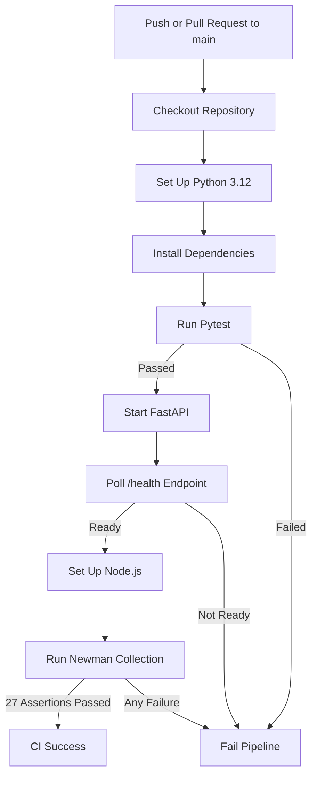
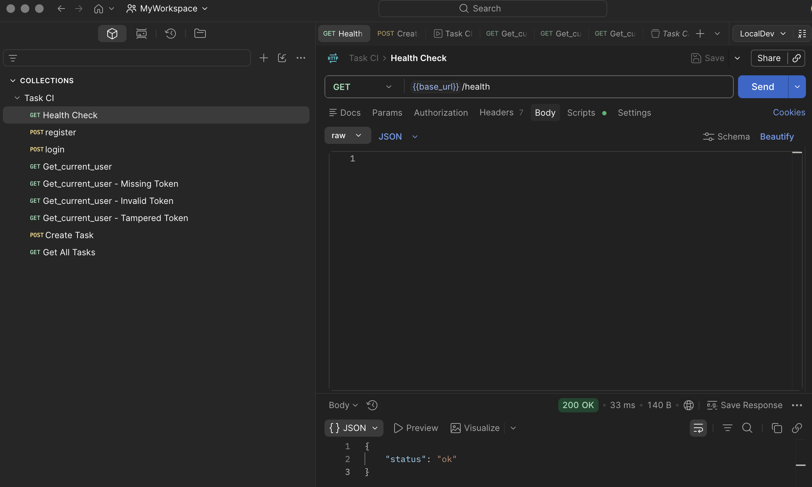
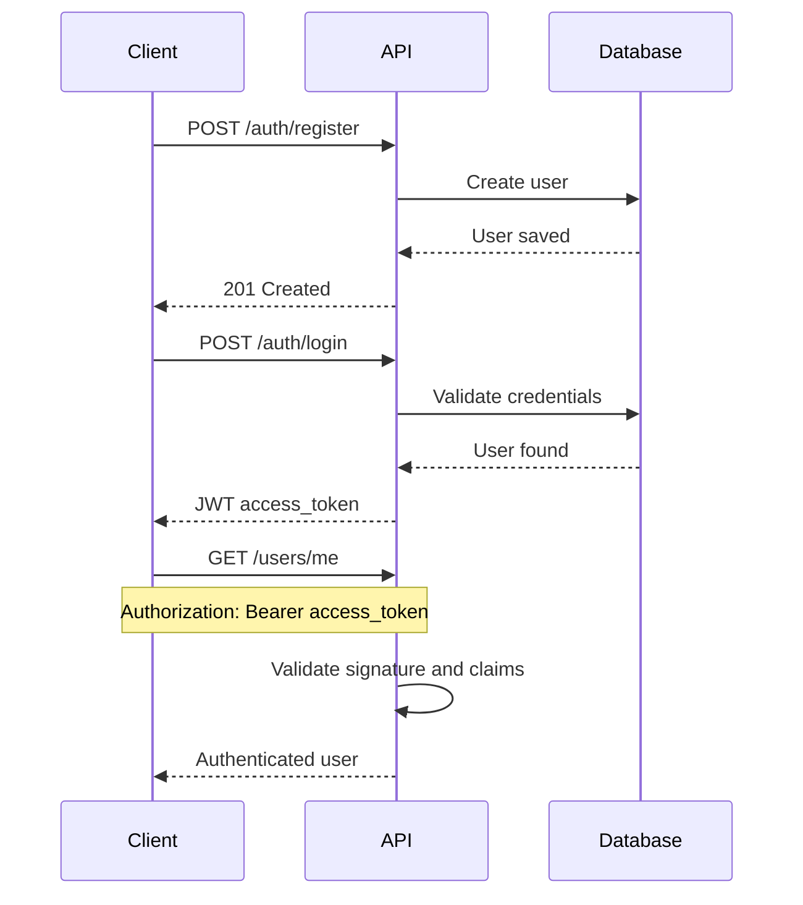
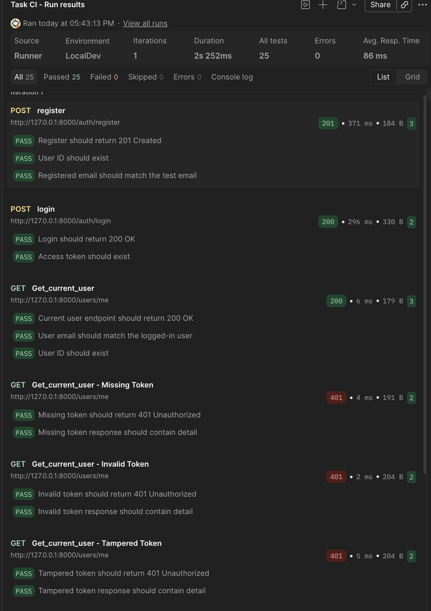
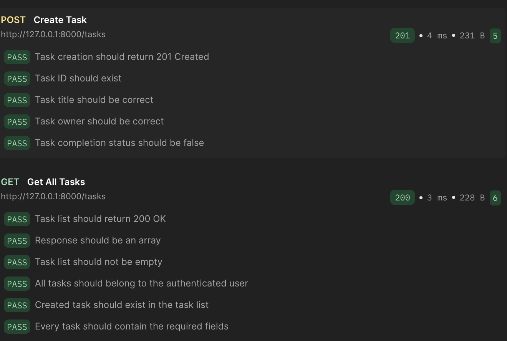
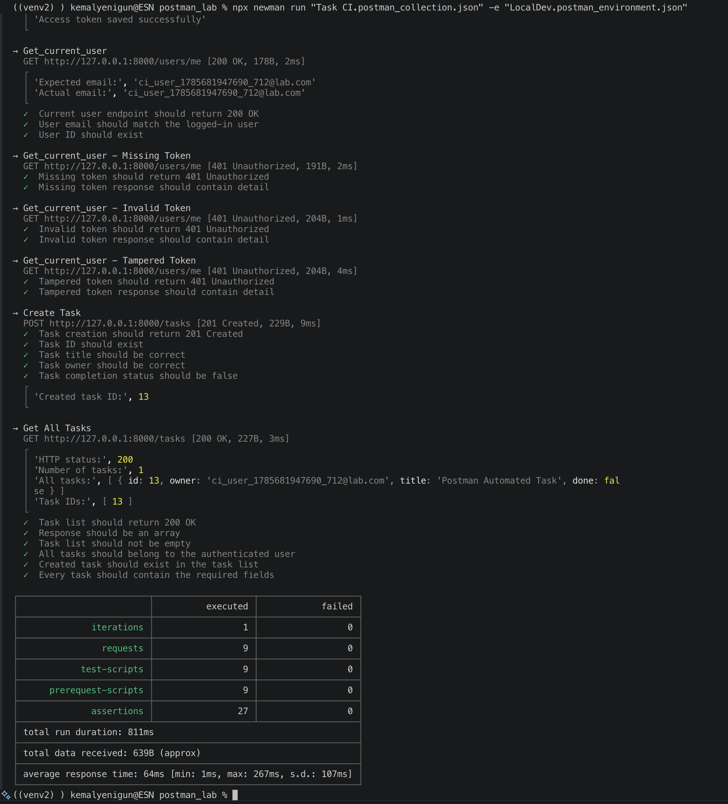

<div align="center">

# 🚀 FastAPI Postman CI Lab

### JWT-Secured API Testing with Pytest, Postman, Newman, and GitHub Actions

[](https://github.com/mkyen/fastapi-postman-ci-lab/actions/workflows/ci.yml)


A practical CI project that automatically validates a JWT-protected FastAPI application on every push and pull request.

</div>

---

## 📌 Project Summary

This project demonstrates how to build an automated API quality gate around a FastAPI application.

The pipeline:

- runs Python integration tests with Pytest;
- starts the FastAPI application inside GitHub Actions;
- waits until the `/health` endpoint becomes available;
- runs the Postman collection through Newman;
- validates positive and negative JWT scenarios;
- fails the workflow when any test or assertion fails.

> [!IMPORTANT]
> This repository implements **Continuous Integration (CI)**.  
> Continuous Deployment (CD) is intentionally not included yet.

---

## 🧪 Current Test Status

| Validation Layer | Result |
|---|---:|
| Pytest integration tests | ✅ 7 passed |
| Newman API requests | ✅ 9 passed |
| Postman assertions | ✅ 27 passed |
| Failed assertions | ✅ 0 |
| GitHub Actions workflow | ✅ Successful |

---

## 🧰 Technology Stack

| API | Testing | Automation | Data |
|---|---|---|---|
| FastAPI | Pytest | GitHub Actions | SQLite |
| Pydantic | Postman | Newman | SQLAlchemy |
| JWT | FastAPI TestClient | CI quality gate | In-memory task store |

---

## 🔄 CI Pipeline



---

## 🌐 API Endpoints

| Method | Endpoint | Authentication | Purpose |
|---|---|---:|---|
| `GET` | `/health` | No | Check API availability |
| `POST` | `/auth/register` | No | Register a new user |
| `POST` | `/auth/login` | No | Authenticate and receive JWT |
| `GET` | `/users/me` | Yes | Return the authenticated user |
| `POST` | `/tasks` | Yes | Create a task |
| `GET` | `/tasks` | Yes | List the authenticated user's tasks |

---

## ✅ Health Check

The CI pipeline waits for the FastAPI service to become ready before Newman starts.

```http
GET /health
```

Expected response:

```json
{
  "status": "ok"
}
```

<p align="center">
  
</p>

---

## 🔐 JWT Authentication Flow



The login request automatically stores the token in the Postman environment:

```text
access_token
```

Protected requests reuse it through:

```http
Authorization: Bearer {{access_token}}
```

---

## 🛡️ JWT Negative Security Tests

### Missing Token

```text
Expected result: 401 Unauthorized
```

### Invalid Token

```text
Expected result: 401 Unauthorized
```

### Tampered Token

A valid JWT is modified before the request. The API must reject it because the signature no longer matches.

```text
Expected result: 401 Unauthorized
```

<p align="center">
  
</p>

<p align="center">
  
</p>

---

## 🧪 Pytest Coverage


The current Python test suite covers:

```bash
pytest -v
```


- ✅ successful login
- ✅ invalid login credentials
- ✅ protected endpoint without a token
- ✅ protected endpoint with an invalid token
- ✅ successful task creation
- ✅ task listing
- ✅ task creation without authentication


### Expected Result

```text
7 passed
```

---

## 📮 Postman Collection Flow

```text
Health Check
    ↓
Register
    ↓
Login
    ↓
Get Current User
    ↓
Missing Token Test
    ↓
Invalid Token Test
    ↓
Tampered Token Test
    ↓
Create Task
    ↓
Get All Tasks
```

### Collection File

```text
Task CI.postman_collection.json
```

### Environment File

```text
LocalDev.postman_environment.json
```

---

## 🌍 Postman Environment Variables

| Variable | Purpose |
|---|---|
| `base_url` | FastAPI base URL |
| `email` | Dynamically generated test user |
| `password` | Test user password |
| `access_token` | JWT returned after login |
| `task_id` | ID of the created task |
| `tampered_token` | Modified JWT for the negative test |

> [!NOTE]
> Dynamic environment variables make the collection reusable and prevent repeated CI runs from conflicting with earlier test data.

---

## 🖥️ Newman CLI Execution

### Start FastAPI

```bash
uvicorn main:app --reload
```

### Run the Collection

```bash
npx newman run "Task CI.postman_collection.json" -e "LocalDev.postman_environment.json"
```

### Expected Result

```text
9 requests
27 assertions
0 failures
```

<p align="center">
  
</p>

---

# ⚙️ Local Setup

## 1. Clone the Repository

```bash
git clone https://github.com/mkyen/fastapi-postman-ci-lab.git
```

## 2. Enter the Project Directory

```bash
cd fastapi-postman-ci-lab
```

## 3. Create a Virtual Environment

```bash
python3.12 -m venv .venv
```

## 4. Activate the Virtual Environment

### macOS / Linux

```bash
source .venv/bin/activate
```

### Windows PowerShell

```powershell
.venv\Scripts\Activate.ps1
```

## 5. Upgrade pip

```bash
python -m pip install --upgrade pip
```

## 6. Install Dependencies

```bash
pip install -r requirements.txt
```

## 7. Start the API

```bash
uvicorn main:app --reload
```

## 8. Open Swagger UI

```text
http://127.0.0.1:8000/docs
```

## 9. Open the Health Endpoint

```text
http://127.0.0.1:8000/health
```

---

# ✅ Run All Tests Locally

## Run Pytest

```bash
pytest -v
```

## Start FastAPI in Another Terminal

```bash
uvicorn main:app --reload
```

## Run Newman

```bash
npx newman run "Task CI.postman_collection.json" -e "LocalDev.postman_environment.json"
```

---

## 📁 Project Structure

```text
fastapi-postman-ci-lab/
├── .github/
│   └── workflows/
│       └── ci.yml
├── docs/
│   └── images/
│       ├── postman_newman_cli_output.png
│       ├── run_tampered_token.png
│       ├── run_tampered_token2.png
│       └── status_ok.png
├── tests/
│   ├── conftest.py
│   ├── test_auth.py
│   └── test_tasks.py
├── LocalDev.postman_environment.json
├── Task CI.postman_collection.json
├── main.py
├── requirements.txt
└── README.md
```

---

# 🧩 GitHub Actions Workflow

## Checkout Repository

```yaml
- name: Checkout repository
  uses: actions/checkout@v6
```

## Set Up Python

```yaml
- name: Set up Python
  uses: actions/setup-python@v6
  with:
    python-version: "3.12"
    cache: pip
```

## Install Dependencies

```yaml
- name: Install Python dependencies
  run: |
    python -m pip install --upgrade pip
    pip install -r requirements.txt
```

## Run Pytest

```yaml
- name: Run Pytest
  run: pytest -v
```

## Start FastAPI

```yaml
- name: Start FastAPI application
  run: |
    nohup uvicorn main:app \
      --host 127.0.0.1 \
      --port 8000 \
      > uvicorn.log 2>&1 &
```

## Wait for FastAPI

```yaml
- name: Wait for FastAPI
  run: |
    for attempt in {1..30}; do
      if curl --fail http://127.0.0.1:8000/health; then
        echo "FastAPI is ready"
        exit 0
      fi

      echo "Waiting for FastAPI..."
      sleep 1
    done

    echo "FastAPI did not start"
    cat uvicorn.log
    exit 1
```

## Set Up Node.js

```yaml
- name: Set up Node.js
  uses: actions/setup-node@v6
  with:
    node-version: "24"
```

## Run Newman

```yaml
- name: Run Newman API tests
  run: npx --yes newman@6.2.2 run "Task CI.postman_collection.json" -e "LocalDev.postman_environment.json" --color on
```

---

## 🔍 What This CI Pipeline Prevents

```text
Broken authentication logic
Invalid JWT handling
Unauthorized access regressions
Failed task operations
API startup failures
Incorrect response status codes
Failed Postman assertions
```

---

## ⚠️ Production Notes

This repository is a learning project. Before production use:

- move `SECRET_KEY` to a secret manager or environment variable;
- replace SQLite with a persistent database;
- replace the in-memory task list with database storage;
- add structured logging and monitoring;
- add dependency security scanning;
- add branch protection rules;
- add Docker and deployment automation.

---


---

<div align="center">


API Automation • JWT Security • Continuous Integration

</div>
